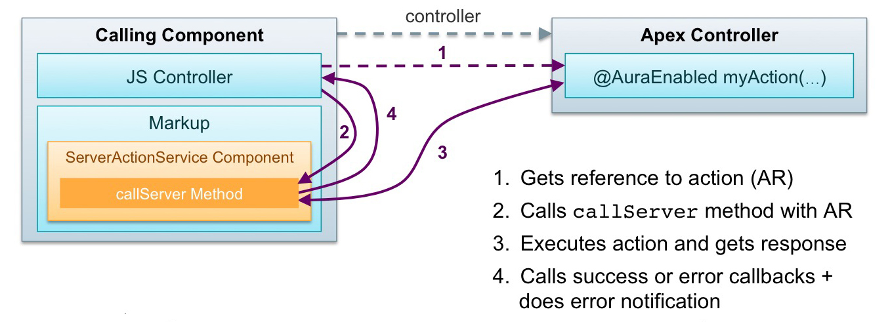
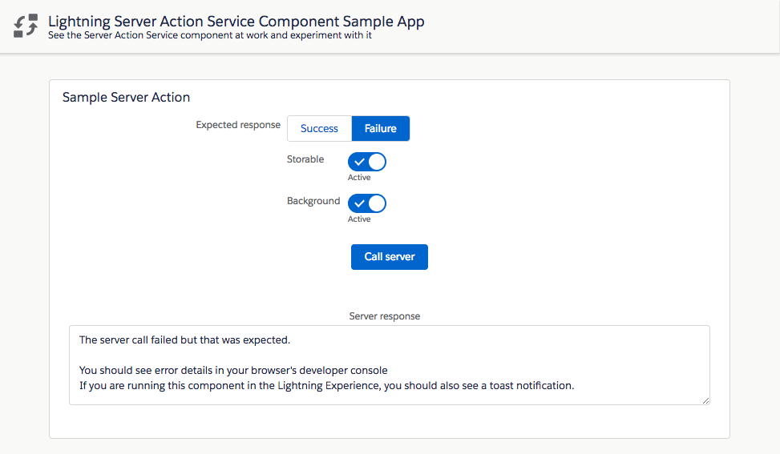

# Salesforce Lightning Server Side Actions Service Component

## About
This is a generic and reusable Lightning component that calls server-side actions.<br/>
This is a service component so it has no user interface of it's own: it is meant to be called by other components.

<b>Features</b>

The component provides the following features:
- integrated error notifications (developer console + toast notifications in Lightning Experience)
- support for storable actions (cached)
- custom success and error callbacks

## Installation

**Option 1:** deploy the component and the sample application with Salesforce DX by clicking on this button:

[](https://deploy-to-sfdx.com)

**Option 2:** install just the service component without the sample app as an unmanaged package either by

**Option 2a:** running this Salesforce DX command:
```
sfdx force:package:install --package 04t1t0000011vSv
```

**Option 2b:** clicking this link:<br/>
https://login.salesforce.com/packaging/installPackage.apexp?p0=04t1t0000011vSv


## Documentation
The component is documented using Aura documentation.<br/>
You can access it from this URL (replace the domain):<br/>
https://<b>&lt;YOUR_DOMAIN&gt;</b>.lightning.force.com/auradocs/reference.app#reference?descriptor=c:ServerActionService&defType=component

Here is an overview of how the service integrates with a calling component:



Use the service by adding the component to a parent component's markup:
```xml
<!-- Add dependency to server side action service -->
<c:ServerActionService aura:id="server"/>
```

Then, simply call a server-side action from the parent's component controller like this:
```js
// Get server action service
const server = component.find('server');
// Get server-side action
const action = component.get('c.anAction');
// Call server-side action with no parameters and no callback
server.callServer(action);
```

Server-side actions can also be called with optional parameters, optional custom success and error handlers:
```js
server.callServer(
    action, // Server-side action
    parameters, // Action parameters
    false, // Disable cache
    $A.getCallback(function(response) { // Custom success callback
        // Handle response
    }),
    $A.getCallback(function(errors) { // Custom error callback
        // Handle errors
    }),
    false, // Disable built-in error notification
    false, // Disable background
    false // Not abortable
);
```

Server-side actions can also be called in a JS Promise chain (**Not supported in IE11**):
```js
server.callServerPromise(
    action, // Server-side action
    parameters, // Action parameters
    false, // Disable cache
    false, // Disable built-in error notification
    false, // Disable background
    false // Not abortable
).then($A.getCallback(response => {
    // Handle response
}))
.catch($A.getCallback(errors => {
    // Handle errors
}));
```

## Sample application
The default installation (if you do not use the package) installs the component and a sample application available under this URL (replace the domain):<br/>
https://<b>&lt;YOUR_DOMAIN&gt;</b>.lightning.force.com/c/SampleServerActionApp.app

If you wish to install manually the project without the sample app, edit `sfdx-project.json` and remove the `src-sample` path.


